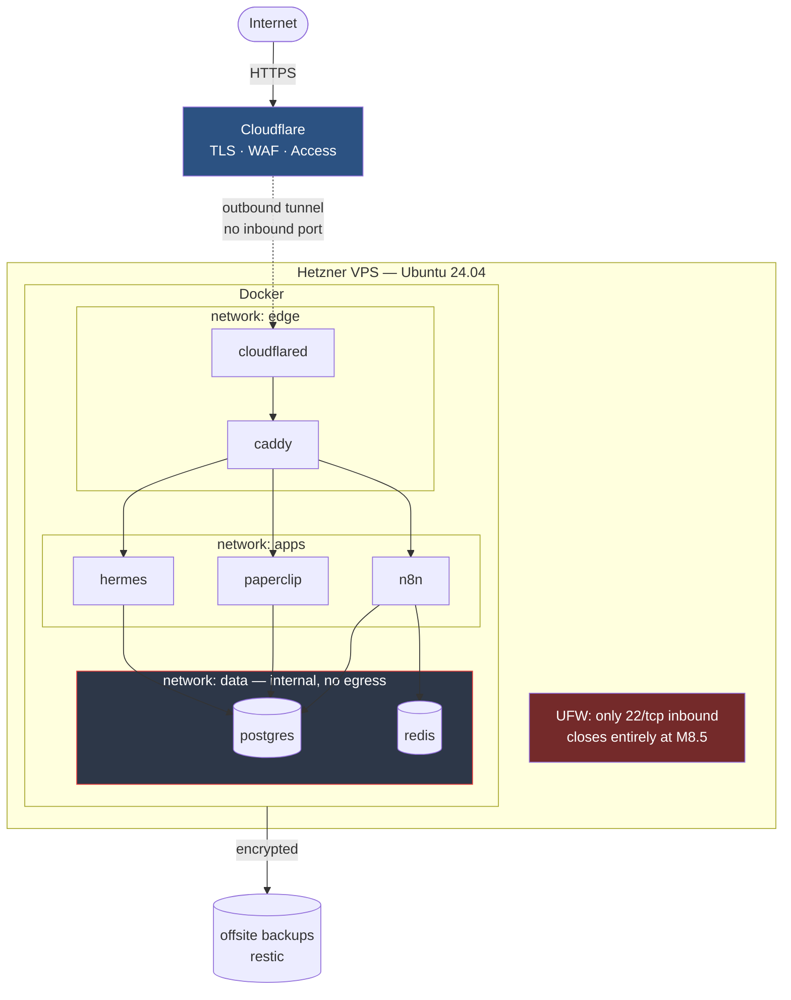

# life-server

Personal AI infrastructure on a single Hetzner VPS. Ubuntu 24.04, everything in
Docker, everything reproducible from this repository.

> **Status:** M0–M5, M7 and M8 complete. The stack is live: Cloudflare Tunnel →
> Caddy → n8n, on PostgreSQL and Redis, with restic backups (restore rehearsed,
> off-host copy verified), Uptime Kuma + ntfy alerting proven by a real outage,
> and secrets encrypted in Git with CI enforcing the repository's invariants.
> See [`docs/milestones/`](docs/milestones/) for each milestone.
>
> Every private hostname sits behind Cloudflare Access as of 2026-07-31. The one
> deliberate exception is the ntfy topic path, which the phone app needs and
> which ntfy's own `deny-all` still protects. Remaining work is in
> **[`docs/OPERATOR-TASKS.md`](docs/OPERATOR-TASKS.md)**.

## Quick start

```bash
make setup     # install local tooling, create .env, generate config
make check     # verify generated files are current
make ping      # confirm the server is reachable
make help      # everything else
```

## What this is

A long-lived host for personal automation and AI agents: n8n, Paperclip,
Hermes, MCP servers, PostgreSQL, Redis. Built to be extended for years rather
than rebuilt.

The design priorities, in order: **security, maintainability, simplicity,
automation, reproducibility.**

## Architecture



The server accepts **one** inbound connection type: SSH on port 22, rate
limited. Web traffic arrives through an outbound-initiated Cloudflare tunnel,
so ports 80 and 443 are never open. Databases sit on an internal network with
no route to the internet and are reachable only by containers explicitly placed
there.

## Repository layout

| Path | Purpose |
|---|---|
| [`services.yml`](services.yml) | **Single source of truth.** Every externally reachable service is declared here and nowhere else. |
| [`generator/`](generator/) | Renders Caddy, tunnel, env and docs config from `services.yml`. |
| [`ansible/`](ansible/) | Host baseline only — users, SSH, firewall, Docker. |
| [`compose/`](compose/) | Docker Compose stacks. `compose/generated/` is machine-written. |
| [`docs/adr/`](docs/adr/) | Architecture Decision Records — why things are the way they are. |
| [`docs/milestones/`](docs/milestones/) | What each milestone changed, how to verify, how to undo. |
| [`scripts/`](scripts/) | Operational scripts. |
| [`env.example`](env.example) | Committed contract for `.env`. `.env` itself is never in Git. |

## Adding a service

One file:

```yaml
# services.yml
- name: myservice
  port: 3000
  description: "What it does"
  networks: [apps, data]
  access: private
```

Then `make generate`. Caddy routes, tunnel ingress, environment variables and
documentation all update. Committing stale generated output fails pre-commit.
See [ADR-0014](docs/adr/0014-service-registry.md).

## Key decisions

Full reasoning in [`docs/adr/`](docs/adr/). The ones that shape everything else:

| | Decision |
|---|---|
| [0001](docs/adr/0001-ansible-for-host-baseline.md) | Ansible for the host, Compose for applications — strict boundary |
| [0003](docs/adr/0003-cloudflare-tunnel-terminates-tls.md) | Cloudflare terminates TLS; Caddy never binds a host port |
| [0004](docs/adr/0004-segmented-docker-networks.md) | Three networks; databases unreachable unless explicitly joined |
| [0005](docs/adr/0005-postgres-db-and-role-per-service.md) | One Postgres, one database and role per service |
| [0006](docs/adr/0006-env-then-sops.md) | Plain `.env` now, SOPS from M7 |
| [0009](docs/adr/0009-backups-before-stateful-services.md) | Backups ship before the first stateful service |
| [0011](docs/adr/0011-pinned-image-versions.md) | Pinned image versions, never `latest` |
| [0014](docs/adr/0014-service-registry.md) | `services.yml` is the single source of truth |

## Roadmap

| | Milestone | Delivers |
|---|---|---|
| M0 | Repository | ✅ ADRs, generator, tooling |
| M1 | Host baseline | ✅ `deploy` user, SSH hardening, UFW, fail2ban |
| M2 | Docker platform | ✅ Docker, segmented networks, filesystem layout |
| M3 | Ingress | ✅ Cloudflare Tunnel + Caddy |
| M4 | Data | ✅ PostgreSQL, Redis, per-service roles |
| M5 | Backups | ✅ restic, rehearsed restore, off-host copy on the laptop |
| M6 | n8n | 🔶 running, owner claimed — needs an Access policy ([M6](docs/milestones/M6.md)) |
| M7 | Deployment | ✅ SOPS, CI with its own age key, `validate` workflow green on every push |
| M8 | Monitoring | ✅ Uptime Kuma + ntfy — outage → alert verified ([M8](docs/milestones/M8.md)) |
| M8.5 | Remote access | ⚠️ **Tailscale ruled out** (work-laptop policy) — needs redesign, likely Cloudflare Access SSH. Goal unchanged: port 22 closed |
| M9 | Applications | ⛔ blocked — Paperclip/Hermes not specified yet |

## Requirements

- macOS or Linux workstation
- `python3` with `pyyaml` and `jinja2`
- `ansible` (`brew install ansible`)
- `pre-commit` (`brew install pre-commit`)
- SSH key at `~/.ssh/life-server`
